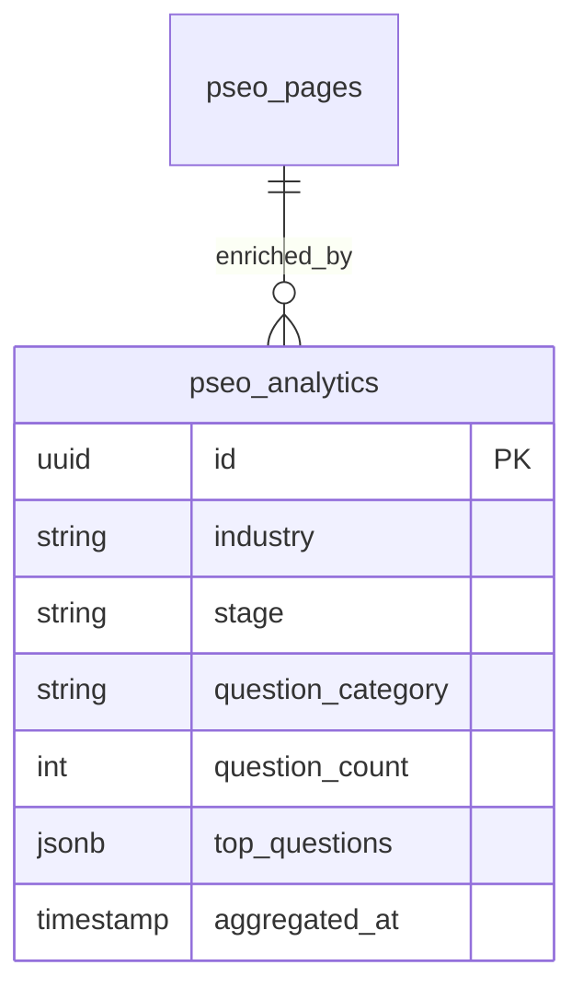

# feat: Add SaaS, Healthcare, Fintech Industries with Analytics

## Overview

Expand Pitchchat's programmatic SEO (pSEO) system from 7 industries to 10 by adding SaaS, Healthcare, and Fintech verticals with complete content files, build-time validation to prevent fallback, and anonymized investor question analytics derived from the main application's conversation data.

**Current State:** 70 pages (7 industries × 2 stages × 5 page types)
**Target State:** 100 pages (10 industries × 2 stages × 5 page types)

## Problem Statement / Motivation

1. **Missing High-Volume Industries:** SaaS, Healthcare, and Fintech represent the highest search volume for startup fundraising content. Their absence limits organic traffic potential.

2. **Fallback Risk:** The current `investorQuestionsSeed.ts` has a generic fallback that serves duplicate content when industry-specific files are missing. Google's March 2024 "scaled content abuse" policy penalizes this.

3. **Untapped Proprietary Data:** The main Pitchchat app collects investor questions in the `messages` table, but this data isn't used to differentiate pSEO content from competitors.

## Technical Approach

### Architecture

```mermaid
graph TB
    subgraph "Configuration Layer"
        A[pilot-config.json] --> B[labelUtils.ts]
        B --> C[contentMatrix.ts]
    end

    subgraph "Content Layer"
        C --> D[/saas/seed.ts]
        C --> E[/saas/series-a.ts]
        C --> F[/healthcare/seed.ts]
        C --> G[/healthcare/series-a.ts]
        C --> H[/fintech/seed.ts]
        C --> I[/fintech/series-a.ts]
    end

    subgraph "Validation Layer"
        J[generateStaticParams] --> K{All imports valid?}
        K -->|Yes| L[Build succeeds]
        K -->|No| M[Build fails]
    end

    subgraph "Analytics Layer"
        N[messages table] --> O[Aggregation Job]
        O --> P{k >= 10?}
        P -->|Yes| Q[pseo_analytics table]
        P -->|No| R[Exclude]
        Q --> S[Content enrichment]
    end
```

### Database Schema Changes



### Implementation Phases

#### Phase 1: Foundation & Build Validation

**Tasks:**
- [ ] Add build-time validation to `generateStaticParams()` that throws on missing content
- [ ] Update `contentMatrix.ts` with exhaustive switch statement (TypeScript catches missing cases)
- [ ] Create CI test that imports all content files and validates structure
- [ ] Add monitoring/alerting for fallback code path execution

**Success Criteria:**
- Build fails if any of 100 industry/stage/pageType combinations lack content
- TypeScript error if new industry added to config but not contentMatrix

**Files to Modify:**
- `pseo/src/app/investor-questions/[industry]/[stage]/[pageType]/page.tsx:79-95`
- `pseo/src/data/content/contentMatrix.ts:42-71`

**Code Example - Build Validation:**

```typescript
// pseo/src/app/investor-questions/[industry]/[stage]/[pageType]/page.tsx

export async function generateStaticParams() {
  const params: Array<{ industry: string; stage: string; pageType: string }> = [];
  const missingContent: string[] = [];

  for (const industry of pilotConfig.industries) {
    for (const stage of pilotConfig.stages) {
      // Validate content exists at build time
      const content = getIndustryStageContent(industry.slug, stage.slug);

      if (!content) {
        missingContent.push(`${industry.slug}/${stage.slug}`);
        continue;
      }

      for (const pageType of pilotConfig.pageTypes) {
        params.push({
          industry: industry.slug,
          stage: stage.slug,
          pageType: pageType.slug,
        });
      }
    }
  }

  // FAIL BUILD if content is missing
  if (missingContent.length > 0) {
    throw new Error(
      `[BUILD FAILED] Missing content files for:\n${missingContent.join('\n')}\n` +
      `Create files in pseo/src/data/content/{industry}/{stage}.ts`
    );
  }

  console.log(`[generateStaticParams] Validated ${params.length} pages`);
  return params;
}

// Prevent runtime generation of unvalidated pages
export const dynamicParams = false;
```

---

#### Phase 2: Content Files for SaaS

**Tasks:**
- [ ] Create `pseo/src/data/content/saas/seed.ts` with all 5 page types
- [ ] Create `pseo/src/data/content/saas/series-a.ts` with all 5 page types
- [ ] Add "saas" to `pilot-config.json` industries array
- [ ] Add SaaS labels and descriptions to `labelUtils.ts`
- [ ] Register SaaS content in `contentMatrix.ts`
- [ ] Validate quality score >= 70 for all 10 SaaS pages

**Success Criteria:**
- All 10 SaaS pages render without fallback
- Quality scores: 70+ for all pages
- Word count: 500+ per page

**Files to Create:**

```
pseo/src/data/content/saas/
├── seed.ts
└── series-a.ts
```

**Content Template - saas/seed.ts:**

```typescript
// pseo/src/data/content/saas/seed.ts
import type { IndustryStageContent } from "../types";

export const saasSeedContent: IndustryStageContent = {
  investorQuestions: {
    summary: "SaaS Seed-stage founders face intense scrutiny on product-market fit, unit economics, and path to scalable growth. Investors evaluate whether your subscription model can achieve the metrics needed for venture-scale returns.",
    questions: [
      {
        category: "Unit Economics",
        question: "What's your current CAC:LTV ratio and path to 3:1?",
        answer: "At seed stage, investors expect you to understand your unit economics even if they're not yet optimized. Break down your Customer Acquisition Cost by channel (paid, organic, sales-led) and explain your assumptions for Lifetime Value based on current churn rates and expansion revenue. Most seed SaaS companies show CAC:LTV between 1:1 and 2:1, with a clear plan to reach 3:1+ through improved retention, pricing optimization, or channel efficiency. Show your cohort analysis if available—even 3-6 months of data demonstrates analytical rigor.",
      },
      // ... 9 more industry-specific questions
    ],
    metrics: [
      {
        label: "Monthly Recurring Revenue (MRR)",
        value: "$10K-$50K",
        note: "Seed SaaS typically shows $10K-$50K MRR with 15-20% month-over-month growth. Focus on growth rate over absolute numbers.",
      },
      // ... 5 more SaaS-specific metrics
    ],
    objections: [
      {
        objection: "Your churn rate is too high to build a sustainable business.",
        response: "Acknowledge the concern directly with data: 'Our monthly churn is currently 8%, which we know is above the 5% benchmark for seed-stage SaaS. Here's our analysis of why customers leave and our three-part retention strategy: [1] Onboarding improvements that increased 30-day activation from 40% to 65% in our last cohort, [2] Feature additions addressing the #1 churn reason (lack of integrations), shipping in Q2, [3] Customer success outreach for accounts showing declining usage. We expect these to reduce churn to 5% within two quarters.'",
      },
      // ... 4 more SaaS-specific objections
    ],
  },
  pitchDeck: {
    summary: "SaaS seed decks must demonstrate product-market fit signals, scalable unit economics potential, and a clear path from current traction to Series A milestones.",
    sections: [
      {
        title: "Problem: The Workflow Gap",
        goal: "Show a specific, quantifiable pain in your target segment's daily work.",
        guidance: "SaaS investors see hundreds of 'productivity' pitches. Differentiate by naming the exact workflow, the persona (job title + company size), and the cost of the status quo. Example: 'Sales managers at 50-200 person companies spend 6 hours weekly reconciling CRM data with marketing automation—that's $15K/year in lost selling time per manager.'",
      },
      // ... 9 more SaaS-specific deck sections
    ],
  },
  metricsBenchmarks: {
    summary: "SaaS seed investors benchmark against these key metrics to evaluate product-market fit and capital efficiency.",
    metrics: [
      {
        label: "Net Revenue Retention (NRR)",
        value: "100-110%",
        note: "Seed-stage NRR above 100% indicates expansion revenue from existing customers. Top quartile seed SaaS shows 105-110%.",
      },
      // ... 7 more SaaS benchmarks
    ],
  },
  diligenceChecklist: {
    summary: "SaaS seed due diligence focuses on validating product-market fit signals, team capability, and unit economics trajectory.",
    items: [
      {
        item: "Customer cohort analysis showing retention curves",
        rationale: "Investors want to see that early customers stick. Provide monthly cohort data showing logo retention and revenue retention over at least 6 months.",
      },
      // ... 14 more SaaS diligence items
    ],
  },
  investorUpdate: {
    summary: "Monthly investor updates for SaaS seed companies should focus on growth metrics, product milestones, and runway.",
    sections: [
      {
        section: "Metrics Dashboard",
        content: "Lead with your north star metric (usually MRR or active users), followed by growth rate, churn, and CAC. Use consistent formatting month-over-month so investors can track trends. Include sparklines or small charts if your email client supports them.",
      },
      // ... 5 more update sections
    ],
  },
};
```

**Configuration Updates:**

```json
// pseo/src/data/pilot-config.json (add to industries array)
{ "slug": "saas", "label": "SaaS" }
```

```typescript
// pseo/src/data/labelUtils.ts (add to industryLabels)
saas: "SaaS",

// Add to industryDescriptions
saas: {
  intro: "Software-as-a-Service startups operate subscription business models with recurring revenue. Investors evaluate SaaS companies on growth efficiency, retention metrics, and path to profitability.",
  focus: ["Unit economics (CAC:LTV)", "Net revenue retention", "Churn reduction", "Product-led growth"],
  keyMetrics: ["MRR/ARR", "NRR", "CAC Payback", "Gross Margin", "Burn Multiple"],
},
```

```typescript
// pseo/src/data/content/contentMatrix.ts (add imports and matrix entry)
import { saasSeedContent } from "./saas/seed";
import { saasSeriesAContent } from "./saas/series-a";

// In contentMatrix object:
saas: {
  seed: saasSeedContent,
  "series-a": saasSeriesAContent,
},
```

---

#### Phase 3: Content Files for Healthcare

**Tasks:**
- [ ] Create `pseo/src/data/content/healthcare/seed.ts` with all 5 page types
- [ ] Create `pseo/src/data/content/healthcare/series-a.ts` with all 5 page types
- [ ] Add "healthcare" to `pilot-config.json` industries array
- [ ] Add Healthcare labels and descriptions to `labelUtils.ts`
- [ ] Register Healthcare content in `contentMatrix.ts`
- [ ] Validate quality score >= 70 for all 10 Healthcare pages
- [ ] Legal review for regulatory content accuracy (FDA, HIPAA references)

**Success Criteria:**
- All 10 Healthcare pages render without fallback
- No HIPAA-violating content (no PHI, no patient data references)
- Quality scores: 70+ for all pages

**Files to Create:**

```
pseo/src/data/content/healthcare/
├── seed.ts
└── series-a.ts
```

**Healthcare-Specific Content Angles:**
- Regulatory pathway (FDA 510(k), De Novo, PMA)
- Clinical validation requirements
- Reimbursement strategy (CPT codes, payer relations)
- HIPAA compliance positioning
- Provider adoption vs. patient engagement models

---

#### Phase 4: Content Files for Fintech

**Tasks:**
- [ ] Create `pseo/src/data/content/fintech/seed.ts` with all 5 page types
- [ ] Create `pseo/src/data/content/fintech/series-a.ts` with all 5 page types
- [ ] Add "fintech" to `pilot-config.json` industries array
- [ ] Add Fintech labels and descriptions to `labelUtils.ts`
- [ ] Register Fintech content in `contentMatrix.ts`
- [ ] Validate quality score >= 70 for all 10 Fintech pages
- [ ] Compliance review for financial services content (SEC, CFPB references)

**Success Criteria:**
- All 10 Fintech pages render without fallback
- No misleading financial claims
- Quality scores: 70+ for all pages

**Files to Create:**

```
pseo/src/data/content/fintech/
├── seed.ts
└── series-a.ts
```

**Fintech-Specific Content Angles:**
- Licensing requirements (state MTLs, federal charters)
- Banking partnership vs. charter strategy
- Fraud prevention and risk management
- Embedded finance opportunities
- Regulatory strategy (SEC, CFPB, state regulators)

---

#### Phase 5: Anonymized Investor Question Analytics

**Tasks:**
- [ ] Create `pseo_analytics` table schema in `pseo/src/db/schema.ts`
- [ ] Implement aggregation job that pulls from main app `messages` table
- [ ] Apply k-anonymity (k >= 10) threshold at industry+stage level
- [ ] Create API endpoint to fetch analytics for pSEO content enrichment
- [ ] Update investor-questions template to display "Top Questions Investors Ask"
- [ ] Add privacy policy update for analytics data usage

**Success Criteria:**
- No individual questions displayed (only aggregated categories/counts)
- Analytics only shown when k >= 10 data points exist
- Refresh interval: Weekly batch job

**Database Schema:**

```typescript
// pseo/src/db/schema.ts (add new table)

export const pseoAnalytics = pgTable(
  "pseo_analytics",
  {
    id: uuid("id").primaryKey().defaultRandom(),
    industry: varchar("industry").notNull(),
    stage: varchar("stage").notNull(),
    questionCategory: varchar("question_category").notNull(),
    questionCount: integer("question_count").notNull(),
    topQuestionPatterns: jsonb("top_question_patterns"), // Aggregated, anonymized
    aggregatedAt: timestamp("aggregated_at").defaultNow(),
  },
  (table) => ({
    industryStageIdx: index("pseo_analytics_industry_stage_idx").on(
      table.industry,
      table.stage
    ),
    industryStageUnique: uniqueIndex("pseo_analytics_industry_stage_category_uq").on(
      table.industry,
      table.stage,
      table.questionCategory
    ),
  })
);
```

**Aggregation Job:**

```typescript
// pseo/src/jobs/aggregateInvestorQuestions.ts

import { db } from "@/db";
import { messages, conversations, links, projects } from "@shared/schema";
import { pseoAnalytics } from "@/db/schema";
import { eq, and, sql } from "drizzle-orm";

const K_ANONYMITY_THRESHOLD = 10;

export async function aggregateInvestorQuestions() {
  // Join messages -> conversations -> links -> projects to get industry/stage
  const rawData = await db
    .select({
      industry: projects.industry,
      stage: projects.stage,
      content: messages.content,
    })
    .from(messages)
    .innerJoin(conversations, eq(messages.conversationId, conversations.id))
    .innerJoin(links, eq(conversations.linkId, links.id))
    .innerJoin(projects, eq(links.projectId, projects.id))
    .where(eq(messages.role, "user")); // Only investor questions

  // Categorize and aggregate
  const aggregated = categorizeAndAggregate(rawData);

  // Apply k-anonymity filter
  const kAnonymous = aggregated.filter(
    (group) => group.questionCount >= K_ANONYMITY_THRESHOLD
  );

  // Upsert to pseo_analytics
  for (const group of kAnonymous) {
    await db
      .insert(pseoAnalytics)
      .values({
        industry: group.industry,
        stage: group.stage,
        questionCategory: group.category,
        questionCount: group.questionCount,
        topQuestionPatterns: group.patterns, // Anonymized patterns, not raw questions
      })
      .onConflictDoUpdate({
        target: [
          pseoAnalytics.industry,
          pseoAnalytics.stage,
          pseoAnalytics.questionCategory,
        ],
        set: {
          questionCount: group.questionCount,
          topQuestionPatterns: group.patterns,
          aggregatedAt: new Date(),
        },
      });
  }

  console.log(`[Analytics] Aggregated ${kAnonymous.length} groups (k >= ${K_ANONYMITY_THRESHOLD})`);
}

function categorizeAndAggregate(data: Array<{ industry: string; stage: string; content: string }>) {
  // Use LLM or keyword matching to categorize questions
  // Return aggregated counts by industry/stage/category
  // NEVER store or return raw question text
}
```

---

## Acceptance Criteria

### Functional Requirements

- [ ] All 100 pages (10 industries × 2 stages × 5 page types) render successfully
- [ ] Build fails if any content file is missing or malformed
- [ ] No fallback content is ever served in production
- [ ] Quality score >= 70 for all published pages
- [ ] Analytics data shows only when k >= 10 data points exist
- [ ] No PII in analytics display (anonymized categories only)

### Non-Functional Requirements

- [ ] Page load time < 2s TTFB for all new pages
- [ ] Build time increase < 30% from current baseline
- [ ] Analytics job completes within 5 minutes
- [ ] Zero TypeScript errors in strict mode

### Quality Gates

- [ ] All content files pass TypeScript type checking
- [ ] Quality score calculation tested for edge cases
- [ ] Legal review complete for Healthcare and Fintech content
- [ ] Privacy review complete for analytics implementation
- [ ] E2E tests cover all 30 new pages

## Success Metrics

| Metric | Target | Measurement |
|--------|--------|-------------|
| Fallback rate | 0% | Monitor for fallback code execution |
| 404 rate for new industries | < 1% | Google Search Console |
| Organic traffic increase | +30% within 3 months | GA4 |
| Build success rate | 100% | CI/CD metrics |
| Analytics coverage | 70%+ of industry/stage combos | k-anonymity filter pass rate |

## Dependencies & Prerequisites

1. **Main App Schema Access:** Analytics job needs read access to `messages`, `conversations`, `links`, `projects` tables
2. **Industry/Stage Tagging:** Projects in main app must have industry and stage fields populated
3. **Content Generation:** 30 content files must be written (can be AI-assisted with human review)
4. **Legal Review:** Healthcare and Fintech content requires compliance sign-off

## Risk Analysis & Mitigation

| Risk | Likelihood | Impact | Mitigation |
|------|------------|--------|------------|
| Content quality below threshold | Medium | High | AI-assisted generation with human review; quality scoring before merge |
| Analytics k-anonymity failures | Medium | Medium | Start with larger categories; fall back to hiding analytics section |
| Build time regression | Low | Medium | Parallelize content validation; cache imports |
| Google penalty for rapid page addition | Low | High | Gradual rollout (10 pages/week); monitor Search Console |

## Documentation Plan

- [ ] Update README with new industry coverage
- [ ] Document content file creation process
- [ ] Add analytics privacy policy section
- [ ] Create runbook for analytics job failures

## References & Research

### Internal References
- Content type definitions: `pseo/src/data/content/types.ts:1-72`
- Content matrix loader: `pseo/src/data/content/contentMatrix.ts:1-117`
- Quality score logic: `pseo/src/lib/qualityScore.ts:1-183`
- Main page route: `pseo/src/app/investor-questions/[industry]/[stage]/[pageType]/page.tsx:1-370`
- Existing content example: `pseo/src/data/content/finance/seed.ts:1-373`
- Messages schema: `shared/schema.ts:153-168`

### External References
- [Google: Creating Helpful Content](https://developers.google.com/search/docs/fundamentals/creating-helpful-content)
- [Google: AI-Generated Content Guidance](https://developers.google.com/search/blog/2023/02/google-search-and-ai-content)
- [Next.js: generateStaticParams](https://nextjs.org/docs/app/api-reference/functions/generate-static-params)
- [K-Anonymity Overview](https://en.wikipedia.org/wiki/K-anonymity)
- [HIPAA Marketing Rules](https://www.hhs.gov/hipaa/for-professionals/privacy/guidance/marketing/index.html)
- [SEC Fintech Guidance](https://www.sec.gov/spotlight/fintech)

### Related Work
- Audit findings validation (this conversation)
- SEO_IMPLEMENTATION_PLAN.md Phase 6 expansion
